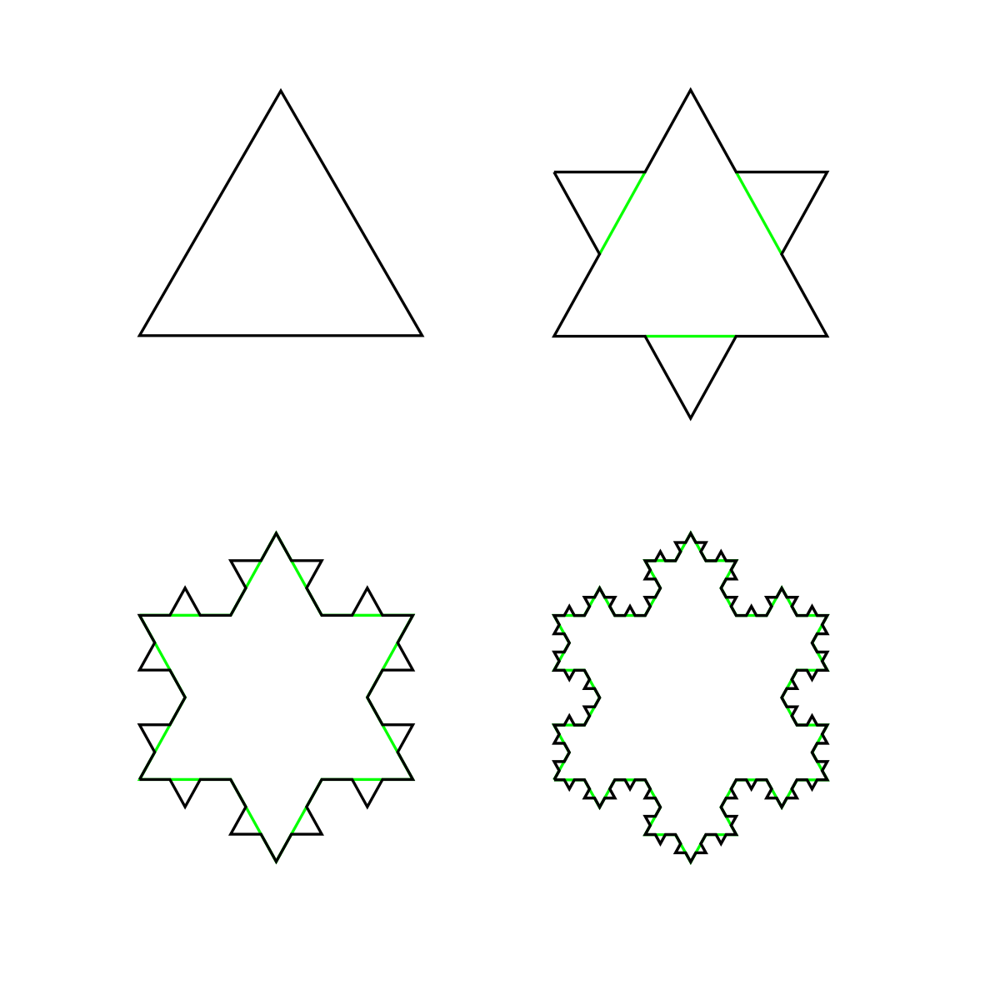

# Organisational

- 2.5 hours of lecture with 10-15 mins break (finish before 17:30)

## Overview

- Curves in $\mathbb R^n$ (most often $n = 2$, $n = 3$) 
- Surfaces in $\mathbb R^3$, Gaussian curvature 
- Riemannian manifolds, abstract objects
- Lorentzian manifolds -> the universe/spacetime is 4-dimensional Lorentzian manifold

# Curves

## Parametric Curves

- A curve is the trajectory of a curve ie. $\gamma I \to \mathbb R^n$ with $I\subseteq \mathbb R$ an interval (open, closed, finite or infinite), $t\in I$ _time_ $\gamma(t)$ _position_ at time $t$, $\gamma$ continuous
- Bad curves
  - Space-filling curves (eg. Peano)
  - $\gamma(t) = p$ (constant) a point
  - nowhere differentiable $\gamma$
  - Koch snowflake is injective, infinite length, area bound by it is finite
    
- From now on: $\gamma : I \to \mathbb R^n$ is differentiable
- Example:
  - semicubical parabola $\gamma(t) = (t^2, t^3)$ -> $x = y^{\frac 23}$, $y = \pm x^{\frac32}$
    
    does not look smooth, there is a cusp at $(0,0)$
- **Definition** A differentiable parametric curve $\gamma: I\to \mathbb R^n$ is called _regular_, if $||\dot\gamma(t)|| \neq 0 \forall t\in I$. 
- **Definition** For $\gamma: I\to \mathbb R^n$ differentiable, $t\in I$ is called _singular_ point if $\||\dot \gamma (t)|| = 0$. It is called _regular_ if it is not singular. A curve with only regular points is a regular curve
- The semicubical parabola has a singular point at $t=0$.
- Note of reference: Singularity theory deals with cusps and swallow tails.
- Tangent to $\gamma$ at a regular point $t_0$:
  ![Fig 1_5]
  $$ l(t) = \gamma(t_0) + (t-t_0)\dot\gamma(t_0),$$

  $$||l(t) -\gamma(t)|| = o(t)$$
- **Definition:** $\gamma: I\to \mathbb R^n$ differentiable ($C^\infty$) curve, let $\varphi: J\to I$ be a diffeomorphism. The curve $\delta = \gamma\circ\varphi: J\to \mathbb R^n$ is called a _reparametrisation_ of $\gamma$. 
- **Lemma:** With above notation, regular points of $\gamma$ correspond to regular points of $\delta$.

  **Proof:** $\dot\delta(s) = \gamma(\varphi(s))\cdot \dot\varphi(s)$. $\dot\varphi(s)$ is nonzero, thus $\dot\delta(s)$ vanishes only if $\dot\gamma(\varphi(s))$ vanishes. For the other direction reparamatize $\delta$ with $\varphi^{-1}$.
- **Corollary:** A reparametrization of a regular curve is again a regular curve. Reparametrization defines an equivalence relation.
- Example:
  $\gamma(t) = (t, 0)$ is regular, $\gamma(t) = (t^3, 0) is not regular ($t= 0$ singular), thus $\gamma$ and $\delta$ are not equivalent, but have the same image (with the right intervals).
- We would like to have a definition of a curve as a set.

## One-dimensional submanifolds of $\mathbb R^n$:

- **Definition:** A $1$-dim submanifold of $\mathbb R^n$ is a connected subset $M\subseteq \mathbb R^n$ s.t. $\forall p\in M$ there is an open neighborhood $V\subseteq \mathbb R^n, p\in V$ and a diffeomorphism $\Phi: V\to W\subseteq \mathbb R^n$ with $\Phi(M\cap V) = W\cap \{x_2 = \dots = x_n = 0\}$. 
- One-dim submanifolds vs. regular curves
  1. If $M\subseteq \mathbb R^n$ is a 1-dim submanifold, then it has a local regular parametrisation around every point. (Obtained from $\Phi^{-1}|_{x_2 = \dots = x_n}$).
  This local parametrisation cannot always be lifted to a global parametrisation. The unit circle is a 1-dim submanifold that can be parametrized, but not bijectively. (There is a bijective parametrization $\gamma(t) = (\cos t, \sin t), I = [0, 2\pi)$, but this $\gamma$ is not a homeomorphism onto its image.
  2. This can be regularily parametrized, but is not a 1-dim submanifold. 
- Global aspects of curves and surfaces are complicated.
  - Locally every regular parametrization is injective (inverse function theorem).
- **Definition:** A $k$-dim submanifold of $\mathbb R^n$ is a connected subset $M\subseteq \mathbb R^n$ s.t. $\forall p\in M$ there is an open neighborhood $V\subseteq \mathbb R^n, p\in V$ and a diffeomorphism $\Phi: V\to W\subseteq \mathbb R^n$ with $\Phi(M\cap V) = W\cap \{x_{k+1} = \dots = x_n = 0\}$. 
- Examples: Torus, Sphere in $\mathbb R^3$.