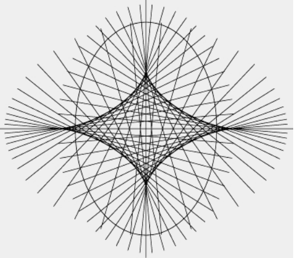

## 4. Tubular neighbourhoods

- Frenet-Serret-formulas for a plane curve:
  - $T:= \dot\gamma, \|\dot\gamma\| = 1$
  - $(T,N)$ positive ONB
  - 
- **THeorem**
  - $\dot T = \kappa_s\cdot N$,
  - $\dot N  -\kappa_s \cdot T$,
  - Proof 
    - First equation by definition
    - $\dot N = aT  + b N, a = \langle \dot N, T\rangle = -\langle N, \dot T\rangle  = -\rangle N,\kappa_s N\rangle = -\kappa_s$, b = \langle \dot N, N\rangle = 0$ because $\|N\| = 1.
- **Definition** Let $\gamma: I\to \mathbb R^2 be any regular curve. Choose $\epsilon \in \mathbb R$. $\gamma_\epsilon := \gamma + \epsilon \cdot \nu_s$ is called the _parallel curve_ to $\gamma$ at distance $\epsilon$.
- **Lemma** The velocity vectors of $\gamma$ and $\gamma_\epsilon$ at the corresponding points are parallel.

  Proof: Assume unit speed. $\dot\gamma_\epsilon = \dot \gamma +\epsilon\dot\nu_s = \dot\gamma + \epsilon \dot N = \dot \gamma + \epsilon \cdot (-\kappa_s)\dot\gamma = (1-\epsilon \kappa_s)\dot\gamma$.
- **Lemma** Let $K = \sup\{\kappa(t)| t\in I\}$. Then $\gamma_\epsilon$ is regular $\forall |\epsilon| <\frac1K$. 

  Proof: $\gamma_\epsilon$ is singular at $t$ $\Leftrightarrow$ $1-\epsilon \kappa_s(t) = 0$ $\Leftrightarrow$ $\epsilon = \frac1{\kappa_s(t)}$. So if $|\epsilon|< \frac1K$, then $|\epsilon| <\frac1{\kappa(t)}$. 

  

- **Theorem** Let $I\subseteq \mathbb R$ be a closed interval, $\gamma: I\to \mathbb R^2$ a unit-speed curve. Fix $r> 0$ and consider $\Phi: I\times [-r,r]\to \mathbb R^2, (t,\epsilon)\mapsto \gamma_\epsilon(t)$. Then, if $\gamma$ is injective, $\Phi$ is a diffeomorphism onto its image for all sufficiently small $r$. 

  Sketch of proof: $\frac{\partial \Phi}{\partial t} = \dot \gamma_\epsilon = (1-\epsilon \kappa_s)\dot\gamma, \frac{\partial \Phi}{\partial \epsilon} = \nu_s(t)$ and for $r<\frac1K$, $\mathrm{det}(\frac{\partial \Phi}{\partial t} , \frac{\partial \Phi}{\partial \epsilon}) = 1-\epsilon\kappa$. Use a topological argument to prevent global overlaps.
- **Definition** If $\Phi$ is a diffeomorphism onto its image, then $\Phi(I\times[-r,r])$ is called a _tubular neighbourhood_ of $\gamma$.
- **Theorem** (Weyl tube formula) The area of the tubular $r$-neighborhood of any simple curve of length $L$ is equal to $2rL$.

  Proof. $\Phi: U\to V$ diffeomorphism, $U,V\subseteq\mathbb R^n$, then $\mathrm{vol}(V) = \int_U|\mathrm{det} \mathrm{d}\Phi|\mathrm d x$. In our case $\Phi(t,\epsilon) = \gamma_\epsilon(t)$ and as shown before $\mathrm{det} = 1-\kappa_s \epsilon$. Then $A(V) = \int_{I\times [-r, r]} ((1-\kappa_s(t)\epsilon)\mathrm dt)\mathrm d\epsilon = \int_I\int_{-r}^r(1-\kappa_s(t)\epsilon)\mathrm d\epsilon \mathrm dt = \int_I((\epsilon - \frac{\kappa_s(t)}2\epsilon^2)|_{-r}^r\mathrm dt) = \int_I 2r\mathrm dt = 2r\cdot |I|$
- "Proper" Weyl tue formula: 
  - any $k$-dim submanifold in $\mathbb R^n$. 
  - Think about curves in $\mathbb R^3$. 

## 5. Evolutes and involutes

- **Definition** The _osculating circle_ of $\gamma$ at $t$ is the circle tangent to $\gamma$ at $t$ and having the same signed curvature. The radius of the osculating  circle is $\frac1{\kappa_s}$. The center is the position vector $\gamma(t) + \frac{\nu_s(t)}{\kappa_s(t)}$. 

  
- Generically, the osculating cirvle locally separates the curve. Points where that does not happen are called _critical_
- Intuitive reason: The osculating circle is the circle through $3$ infinitely close points.
- **Theorem** (Tait-Kneser) If $\kappa is monotone, then the osculating circles are nested. 
- **Definition** The curve formed by the centers of the osculating circles of $\gamma$ is called the _evolute_ of $\gamma$. $\mathcal E_\gamma(t) = \gamma(t) + \frac1{\kappa_s(t)}\cdot\nu_s(t)$.
- **Lemma** The evolute of $\gamma$ consists of the singular points of the curves parralel to $\gamma$. 

  Proof: $\dot\gamma_\epsilon =  (1-\epsilon \kappa_s)\dot\gamma
  
- **Theorem** The tangent to the evolute intersects $\mathcal E_\gamma$ intersects $\gamma$ at the corresponding point (by parameter) and does this orthogonally. 

  Proof. Assume unit speed. $\dot{\mathcal E}_\gamma(t) = \dot\gamma(t) + (\frac1{\kappa_s(t)})^\cdot\nu_s(t) + \frac1{\kappa_s(t)}\dot\nu_s(t) = (\frac1{\kappa_s(t)})^\cdot\nu_s(t)$ as $\dot\nu_s = -\kappa_s\dot\gamma$. 

  The tangent to $\mathcal E_\gamma$ at $t$: $\{\mathcal E_\gamma(t) + \lambda \dot{\mathcal E}_\gamma(t) | \lambda \in \mathbb R\} = \{\gamma(t) + \frac1{\kappa_s(t)}\nu_s(t)  + \lambda(\frac1{\kappa_s(t)})^\cdot\nu_s(t) \} = \{\gamma(t) + \mu \nu_s(t)\}$.

  
- **Corollary** Singular points of $\mathcal E_\gamma$ correspond ot the critical points of $\kappa(t)$.
- **Definition** Put a string along a curve and unwind it. The endpoint of the string traces an _involute_ (also called _evolvent_) of $\gamma$. $I_{\gamma,t_0} = \gamma(t) - L(\gamma|_{t_0}^t)\cdot \frac{\dot\gamma}{\|\dot\gamma\|}$. If $\gamma$ is unit speed, then $I_{\gamma,t_0}(t) = \gamma(t) - (t-t_0)\dot \gamma$. 
- **Lemma** The tangents to $\gamma$ are orthogonal to $I_{\gamma,t_0}$. 

  Proof. Without loss of generality we may assume unit speed. Then $\dot I_{\gamma, t_0}(t) = \dot\gamma(t) - \dot\gamma(t) - (t-t_0)\ddot\gamma = -(t-t_0)\ddot\gamma \perp \dot\gamma$.
- **Lemma** Let $\gamma$ be unit-speed. Denote $I_{\gamma,t_0}=:\Gamma$. Then $\kappa^\Gamma(t) = \frac1{t-t_0}$ and $\kappa_s^\gamma$ and $\kappa_s^\Gamma$ have the same sign.

  Proof. $\kappa^\Gamma = \frac{|\dot\alpha^\gamma|}{\|\dot\Gamma\|}$. $\alpha^\Gamma = \alpha^\gamma + \frac\pi2$. Therefore $\dot\alpha^\Gamma = \dot\alpha^\gamma$. This shows that the curvatures have the same sign. Now $\dot\Gamma = -(t-t_0)\ddot\gamma$ and thus $\|\dot\Gamma(t)\| = (t-t_0)\kappa^\gamma(t)$. Then $\kappa^\Gamma = \frac{|\dot\alpha^\gamma|}{(t-t_0)\kappa^\gamma}$. With $\kappa^\gamma = \frac{|\dot\alpha^\gamma|}{\|\dot\gamma\|} = |\dot\alpha^\gamma|$ we see  $\kappa^\Gamma(t) = \frac1{t-t_0}$.
- **Theorem** Let $\gamma$ be a curve with $\kappa(t)\neq 0$ for all $t$. Then the evolute of an involute of $\gamma$ is $\gamma$. 

  Proof. $\mathcal E_\Gamma(t) = \Gamma(t) + \frac1{\kappa_s^\Gamma(t)}\nu_s^\Gamma(t)$. Assume $\kappa_s^\Gamma>0$. $\mathcal E_\Gamma(t) = (\gamma(t)-(t-t_0)\dot\gamma) + (t-t_0) \nu_s^\Gamma(t)\dot\gamma = \gamma(t)